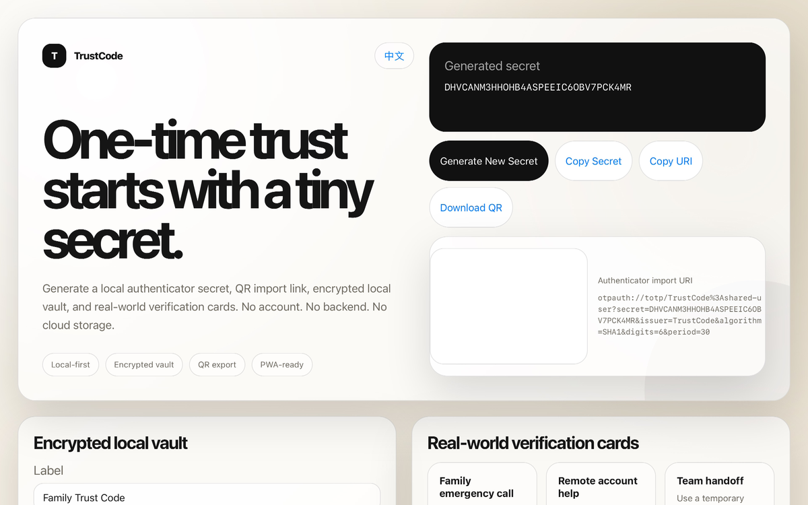
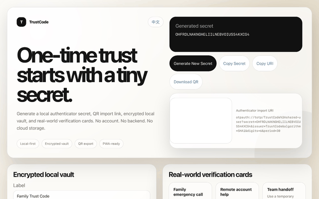

<div align="center">

# TrustCode

### One-time trust codes for shared verification

A polished local TOTP toolkit for shared trust checks, authenticator-compatible secrets, QR imports, encrypted local storage, PWA use, browser extensions, and developer testing.

[English](#english) · [中文](#中文)



</div>

---

<a id="english"></a>

## What is TrustCode?

**TrustCode** is a local-first toolkit for generating TOTP secrets that work with common authenticator apps.

Trusted people can share one secret and compare the current code when identity matters. Developers can also use it for 2FA testing, QR-code onboarding demos, private group verification, plugin prototypes, and local security experiments.

TrustCode treats TOTP as more than a login feature. It turns any authenticator app into a small real-time trust signal.

---

## Live demo

**👉 [https://dreaminmaster.github.io/TrustCode/](https://dreaminmaster.github.io/TrustCode/)**

Try TrustCode directly in your browser — no installation required.

### Preview



---

## Available versions

| Version | File / Folder | How to run | What it does |
|---|---|---|---|
| English Python | `trustcode.py` | `python trustcode.py` | Generates a secret, current code, import URI, and QR image in English. |
| Chinese Python | `trustcode_zh.py` | `python trustcode_zh.py` | Generates a secret, current code, import URI, and QR image in Chinese. |
| Local HTML app | `index.html` | Open it in a browser | Generates a local secret, QR import link, encrypted local vault, QR download, and scenario cards. |
| Structured web version | `web/` | Open `web/index.html` or maintain the split files | Cleaner web structure with separate HTML, CSS, and JS files. |
| PWA mode | `manifest.webmanifest` + `sw.js` | Serve with GitHub Pages or a local server | Allows install-like mobile usage and offline caching. |
| Browser extension | `extension/` | Load as an unpacked extension | Provides a small popup for quick secret and QR generation. |

---

## Highlights

- Local-first secret generation
- No account required
- No cloud storage
- Authenticator-compatible import URI
- QR code export through the Python versions
- Polished browser-based HTML version
- Encrypted local vault using browser storage
- QR code PNG download from the web app
- PWA manifest and service worker
- Browser extension starter version
- Real-world verification scenario cards
- Root single-file HTML and structured `web/` version
- Default label, no manual service or account input required
- English and Chinese Python versions
- Bilingual documentation
- MIT License

---

## Use cases

### Family trust check

Trusted family members can share one secret and compare the current code in suspicious or urgent situations.

For example, if someone claims to be a family member and asks for money, account access, verification codes, or urgent help, the current code can act as one extra trust check before taking action.

TrustCode is designed as an extra trust check, not as the only proof of identity.

### 2FA development and testing

Generate test secrets and QR codes for login systems, authenticator onboarding, internal tools, demos, and security education.

### Plugin and automation foundation

TrustCode can be used as a base for a browser extension, Raycast extension, Alfred workflow, Obsidian plugin, VS Code utility, iOS Shortcut, or local desktop widget.

### Private shared verification

Friends, partners, classmates, or small teams can use a shared time-based code as a lightweight identity confirmation method.

### Offline identity check

After the secret is imported, no internet connection is required. As long as both devices have accurate time, both sides can generate matching codes.

---

## Usage

Choose one version:

### English Python version

Use this if you prefer English terminal output.

```bash
pip install -r requirements.txt
python trustcode.py
```

### Chinese Python version

Use this if you prefer Chinese terminal output.

```bash
pip install -r requirements.txt
python trustcode_zh.py
```

### HTML local version

Use this if you do not want to install Python. Open the file directly in your browser:

```text
index.html
```

The HTML app includes local secret generation, QR export, encrypted local saving, interface language switching, and real-world verification cards.

### Structured web version

Use this if you want to maintain or extend the web app with cleaner files:

```text
web/index.html
web/styles.css
web/app.js
```

### PWA mode

Use GitHub Pages or a local server to serve the project, then open the page on a phone and add it to the home screen.

```bash
python -m http.server 8000
```

Then open:

```text
http://localhost:8000
```

### Browser extension version

Open your Chromium-based browser extension page, enable Developer Mode, choose **Load unpacked**, and select the `extension/` folder.

---

## Security notes

TrustCode is designed as an extra trust check, not a single source of truth.

- Never publish your secret.
- Anyone with the same secret can generate the same codes.
- Use shared secrets only with people you trust.
- Encrypted local storage depends on your password and browser data.
- If you forget the vault password, saved secrets cannot be recovered.
- Do not use this as the only protection for financial, legal, medical, or emergency decisions.
- For high-risk situations, verify through multiple trusted channels.

---

## License

This project is released under the MIT License.

---

## Disclaimer

TrustCode is provided for educational, personal, and development purposes.

It does not replace official 2FA systems, emergency services, banking verification, legal identity checks, or professional security tools.

---

<a id="中文"></a>

# 中文说明

## TrustCode是什么？

**TrustCode**是一个本地优先的TOTP工具，用来生成可以导入常见验证器App的密钥。

可信任的人可以提前共享一个密钥，在需要确认身份时比对当前动态码。开发者也可以把它用于双重验证测试、二维码导入演示、私人小组确认、插件原型和本地安全工具实验。

TrustCode不只是把TOTP当作登录安全功能，而是把任何验证器App变成一个小型实时信任信号。

---

## 在线演示

**👉 [https://dreaminmaster.github.io/TrustCode/](https://dreaminmaster.github.io/TrustCode/)**

无需安装，直接在浏览器中体验 TrustCode。

### 预览


---

## 可用版本

| 版本 | 文件 / 文件夹 | 运行方式 | 功能 |
|---|---|---|---|
| 英文Python版 | `trustcode.py` | `python trustcode.py` | 用英文生成密钥、当前验证码、导入链接和二维码图片。 |
| 中文Python版 | `trustcode_zh.py` | `python trustcode_zh.py` | 用中文生成密钥、当前验证码、导入链接和二维码图片。 |
| HTML本地网页版 | `index.html` | 用浏览器打开 | 生成本地密钥、二维码导入链接、加密本地密钥库、二维码下载和场景提示卡。 |
| 结构化Web版 | `web/` | 打开 `web/index.html` 或维护拆分文件 | 使用独立 HTML、CSS、JS 文件，方便后续开发维护。 |
| PWA模式 | `manifest.webmanifest` + `sw.js` | 通过GitHub Pages或本地服务器访问 | 支持类似手机App的添加到主屏幕和离线缓存体验。 |
| 浏览器插件版 | `extension/` | 作为浏览器未打包插件加载 | 提供一个弹窗工具，用于快速生成密钥和二维码。 |

---

## 功能亮点

- 本地优先
- 不需要注册账号
- 不需要云端存储
- 支持验证器App导入链接
- Python版本支持二维码导出
- 精致的HTML网页版本
- 浏览器本地加密密钥库
- 网页版支持二维码PNG下载
- PWA清单和Service Worker
- 浏览器插件基础版
- 面向现实验证场景的提示卡片
- 根目录单文件HTML和结构化 `web/` 版本
- 默认标签，不需要手动输入服务名称和账号名称
- 提供英文和中文Python版本
- README默认英文并提供中文说明
- MIT License

---

## 使用场景

### 家庭信任确认

可信任的家人可以共享一个密钥，在可疑或紧急场景下比对当前动态码。

比如有人冒充亲属、朋友、客服、警察或平台工作人员，并要求转账、提供验证码、登录账户时，可以先要求对方说出当前动态码。

TrustCode适合作为额外确认步骤，而不是唯一身份依据。

### 双重验证开发测试

生成测试用密钥和二维码，用于登录系统、验证器导入流程、内部工具、演示项目和安全教育。

### 插件和自动化基础

TrustCode可以作为浏览器插件、Raycast插件、Alfred工作流、Obsidian插件、VS Code小工具、iOS快捷指令或本地桌面小组件的基础。

### 私人共享验证

朋友、情侣、同学、小团队可以使用同一个动态码作为轻量身份确认方式。

### 离线身份确认

导入密钥后，不需要网络。只要双方手机时间准确，就能生成相同的动态码。

---

## 使用方法

选择一个版本：

### 英文Python版

适合想使用英文终端说明的用户。

```bash
pip install -r requirements.txt
python trustcode.py
```

### 中文Python版

适合想使用中文终端说明的用户。

```bash
pip install -r requirements.txt
python trustcode_zh.py
```

### HTML本地网页版

不想安装Python时，直接用浏览器打开：

```text
index.html
```

HTML版本包含本地密钥生成、二维码导出、加密本地保存、界面语言切换和现实验证提示卡。

### 结构化Web版

适合后续继续开发维护：

```text
web/index.html
web/styles.css
web/app.js
```

### PWA模式

通过GitHub Pages或本地服务器访问项目页面，然后在手机浏览器中添加到主屏幕。

```bash
python -m http.server 8000
```

然后打开：

```text
http://localhost:8000
```

### 浏览器插件版

打开 Chromium 系浏览器的扩展管理页面，开启开发者模式，选择“加载已解压的扩展程序”，然后选择 `extension/` 文件夹。

---

## 安全提醒

TrustCode适合作为额外确认步骤，而不是唯一判断依据。

- 不要公开你的密钥。
- 任何拿到同一个密钥的人都能生成相同验证码。
- 只应与可信任的人共享密钥。
- 本地加密保存依赖你的密码和浏览器数据。
- 如果忘记本地密钥库密码，已保存的密钥无法恢复。
- 不要把它作为金融、法律、医疗或紧急情况的唯一判断依据。
- 高风险场景下，应通过多个可靠渠道确认。

---

## License

本项目使用 MIT License。

---

## 免责声明

TrustCode仅用于教育、个人和开发测试目的。

它不能替代官方双重验证系统、紧急服务、银行验证、法律身份认证或专业安全工具。
